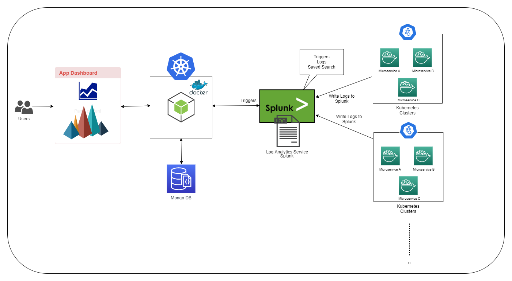

# Project Group-15

### Team
Vamsi Mundra, 
Akhil Reddy Mandadi, 
Jagan Gadamsetty, 
Srinivas Rao Samudrala

# Applications Health Analysis. 

###### Abstract: 
Any Major application which will be formed by a different set of micro services, so there will be many inter dependent API’s which will be failing due to many issues. Applications Health Analysis will give the detail report of what are the API’s which are failing with frequency and dependent API’s which are getting effected by the failed API’s. By which user can identify the issues mainly in the production environments where a single failure of an API will cause a feature to break. User can also track the modules of the product which are failing frequently and take necessary actions on it and testing them thoroughly before releasing them. 
 
# Architecture

###### Technology stack:
Front-End :  React JS , Bootstrap  
Backend: NodeJs, Express JS. 
Database: MongoDB. 
Log Analysis: Splunk. 
Cloud: AWS, IBM Kubernetes Cluster. 

